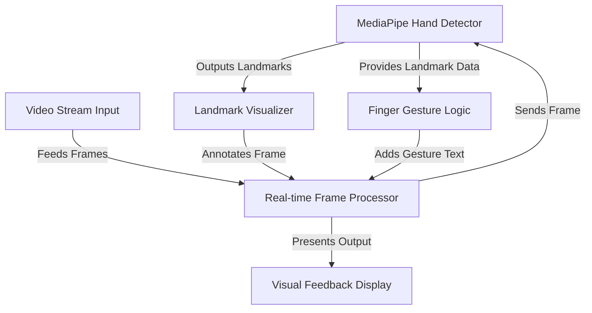
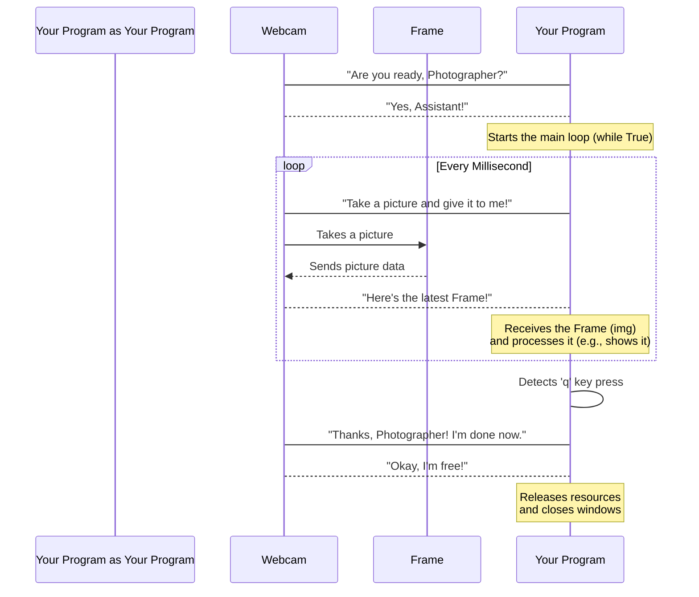
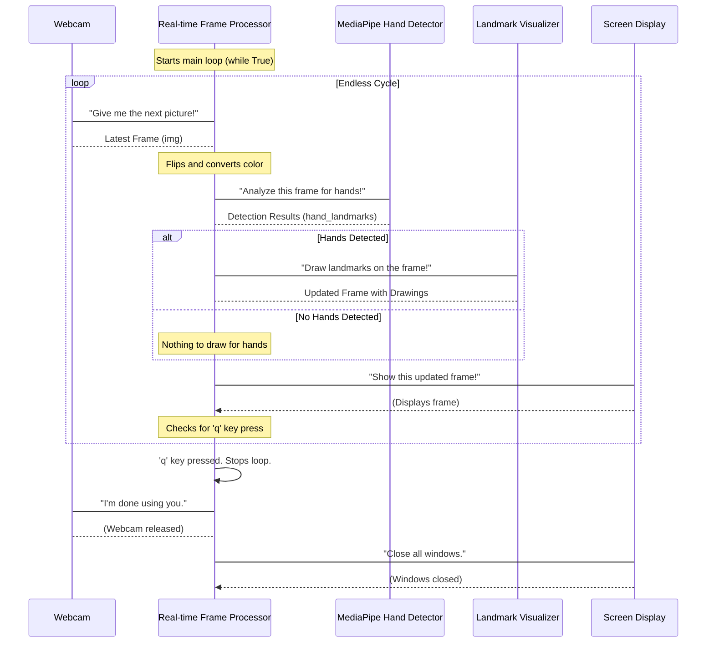
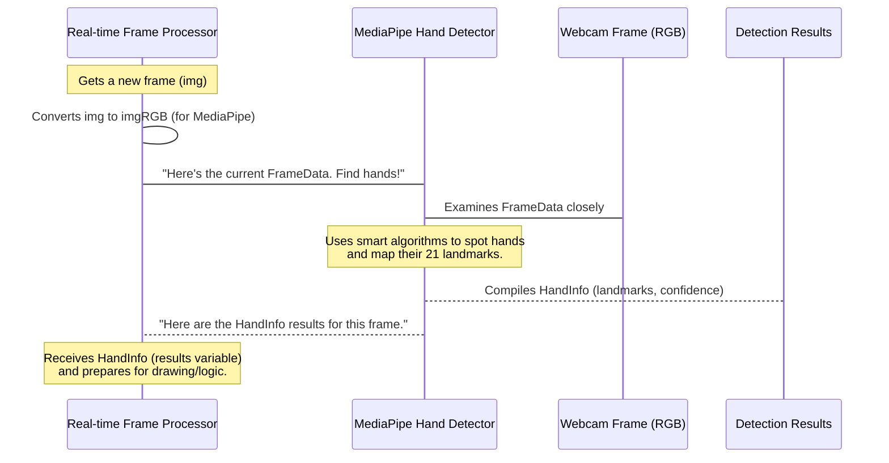
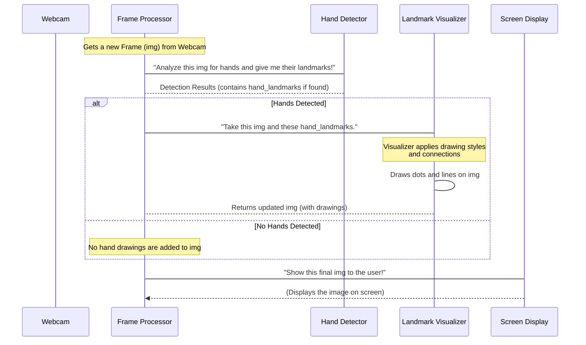
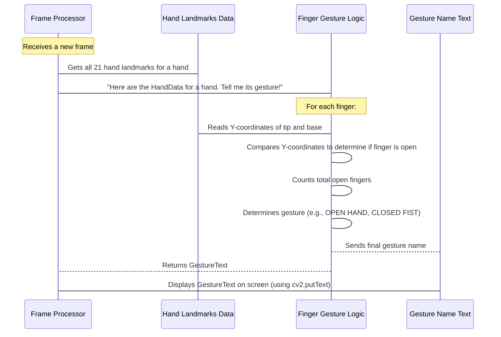
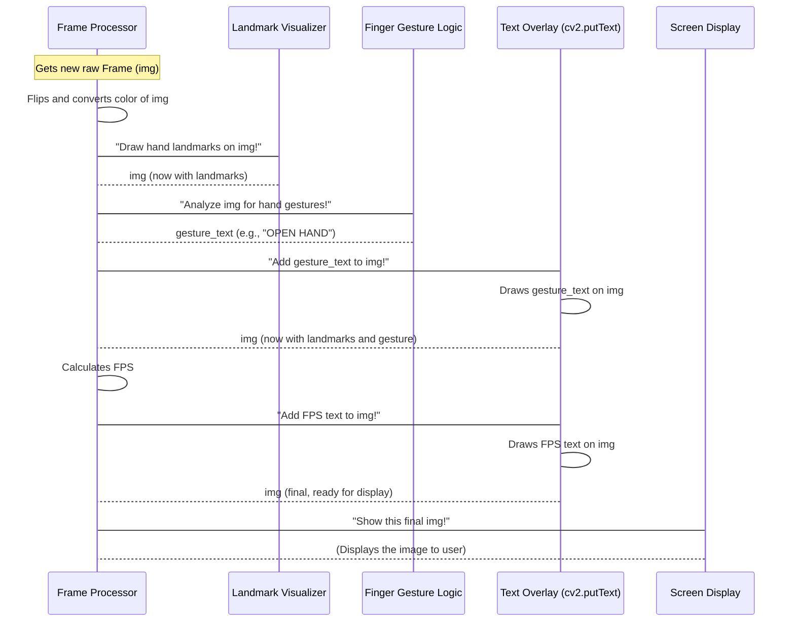

# Tutorial: hands_motion_detect

This project acts like a "smart eye" that uses your webcam to **see** your hands in real-time. It can *detect* where all the joints in your fingers and palm are, then *figure out* how many fingers you're holding up (or if your hand is open or a closed fist). Finally, it shows you what it sees and understands directly on your screen, complete with helpful labels and performance information.


## Visual Overview



# Chapter 1: Video Stream Input

Welcome to the `hands_motion_detect` project! This project helps your computer understand what your hands are doing, like if you're holding up fingers or making a fist. But before your computer can understand your hands, it first needs to **see** them!

Think of it like this: if you want to know what's happening outside your window, you need to open your eyes and look, right? For our computer program, its "eyes" are your **webcam**, and what it "sees" is a **Video Stream Input**.

This chapter is all about how our project opens its "eyes" and continuously gets new visual information, frame by frame, allowing it to process live video.

### What is a Video Stream?

Imagine you're watching a movie. It looks like continuous motion, but it's actually just many still pictures, called **frames**, shown to you very, very quickly! If you flip through a flipbook fast enough, it also looks like animation – that's the idea behind a video stream.

Our project works in a similar way: it continuously grabs these "pictures" (frames) from your webcam, one after another, creating a constant stream of visual information.

### Getting Pictures from Your Webcam

To get these pictures, our project uses a powerful tool called `OpenCV` (short for Open Source Computer Vision Library). In Python, we use the `cv2` part of `OpenCV`.

First, we need to tell Python we want to use `OpenCV`'s tools:

```python
import cv2
```
*What this does:* This line is like saying, "Hey Python, let's load up all the `OpenCV` tools so we can use them!"

Next, we tell `OpenCV` to connect to our webcam. Most computers have a "default" webcam, which we refer to with the number `0`.

```python
# Connect to the default webcam (usually 0)
cap = cv2.VideoCapture(0)
```
*What this does:* We're creating a `VideoCapture` object. Think of `cap` as a remote control for your webcam! Now, your program can send commands to the webcam, like "start sending me pictures!"

It's always a good idea to check if the webcam connection actually worked:

```python
# Check if webcam opened successfully
if not cap.isOpened():
    print("Error: Could not open webcam.")
    exit()
```
*What this does:* This little check makes sure your webcam is ready. If it's not, it prints an error message and stops the program.

### The Continuous Flow of Frames

Once connected, our program needs to keep asking the webcam for new pictures. We do this inside a special loop that runs forever (or until we tell it to stop). This loop ensures we get a **real-time** stream.

```python
while True:
    # Read a frame from the webcam
    success, img = cap.read()

    # If we couldn't get a frame (e.g., webcam unplugged), skip this round
    if not success:
        print("Ignoring empty camera frame.")
        continue

    # --- More processing will happen here in later chapters ---
    # For now, let's just show the raw webcam feed
    cv2.imshow('My Webcam Feed', img)

    # Press 'q' to quit the program
    if cv2.waitKey(1) & 0xFF == ord('q'):
        break
```
*What this does:*
*   `while True:`: This creates an endless loop.
*   `success, img = cap.read()`: This is the magic line! `cap.read()` asks the webcam for its next picture.
    *   `success` will be `True` if it got a picture, `False` otherwise.
    *   `img` is where the actual picture data (the "frame") is stored. It's like a big grid of numbers, each representing a tiny dot of color.
*   `if not success: continue`: If the webcam hiccups and doesn't send a picture, we just skip to the next loop cycle.
*   `cv2.imshow('My Webcam Feed', img)`: This line pops up a window on your screen and displays the `img` (the picture) that we just received.
*   `if cv2.waitKey(1) & 0xFF == ord('q'): break`: This part checks if you've pressed the 'q' key. If you have, it tells the loop to `break` (stop), so the program can end cleanly.

### Cleaning Up

When your program is done using the webcam, it's good practice to "release" it. This frees up the webcam so other programs can use it. We also close any `OpenCV` windows that popped up.

```python
# Release the webcam
cap.release()
# Close all OpenCV display windows
cv2.destroyAllWindows()
print("Webcam released and windows closed.")
```
*What this does:* These lines are like saying "Okay webcam, I'm done with you now!" and closing all the picture windows.

### How it Works Behind the Scenes

Let's imagine your computer program is a very focused **Assistant** and your webcam is a busy **Photographer**. Here's a simple step-by-step of how the "Video Stream Input" works:



As you can see, your program is constantly asking for and receiving new frames, making it possible to work with live video! All these essential lines of code are found together in our `README.md` file, setting up the initial connection to your webcam.

### Summary

In this chapter, you learned that:
*   Our project's "eyes" are your **webcam**, providing a **Video Stream Input**.
*   A video stream is a series of individual **frames** (pictures) shown very quickly.
*   We use the `OpenCV` library (specifically `cv2`) in Python to connect to the webcam (`cv2.VideoCapture(0)`).
*   The `cap.read()` function is used inside a `while True` loop to continuously grab new frames.
*   We always clean up by releasing the webcam and closing windows (`cap.release()`, `cv2.destroyAllWindows()`).

Now that our project knows how to "see" the world by getting a constant stream of pictures, what's next? We need to figure out what to *do* with those pictures! In the next chapter, we'll dive into the [Real-time Frame Processor](02_real_time_frame_processor_.md), which is like the program's "brain" that gets ready to understand each incoming picture.


# Chapter 2: Real-time Frame Processor

Welcome back! In [Chapter 1: Video Stream Input](01_video_stream_input_.md), we learned how our project's "eyes" (your webcam) continuously capture a stream of still pictures, or **frames**. Now that our program knows how to *see* the world, what's the next step? It needs to constantly *do something* with each of those frames, right?

Imagine you're a chef in a busy kitchen. Ingredients (frames) keep arriving. You can't just let them pile up; you need to quickly and continuously:
1.  **Grab** the next ingredient.
2.  **Prepare** it (chop, mix, cook).
3.  **Garnish** it.
4.  **Serve** it to the customer.

Our `hands_motion_detect` project works in a very similar way. This is where the **Real-time Frame Processor** comes in. It's the project's "heartbeat" or the "chef" in our kitchen analogy. It's a continuous, rapid cycle that repeats endlessly for every single frame received from the webcam. This ensures everything runs smoothly and in **real-time**, meaning you see results happening almost instantly as you move your hands.

### What Does the Processor Do?

The Real-time Frame Processor has a simple but powerful job. For every new picture (frame) that comes from the webcam, it performs a set of four core actions:

1.  **Grab:** Get the very latest image from the camera.
2.  **Analyze:** Examine the image to find hands and understand their positions.
3.  **Draw:** Add visual information (like dots and lines on the hands) directly onto the image.
4.  **Show:** Display the updated image on your computer screen.

This entire sequence happens many times per second, making it feel like smooth, live video processing.

### The Endless Loop: Our Processor's Engine

The heart of our Real-time Frame Processor is an `while True` loop. This Python concept means "do this forever, until I tell you to stop." Let's look at the core structure from our `README.md` file:

```python
while True:
    # 1. Grab a new frame
    success, img = cap.read()
    if not success:
        continue # Skip if no frame

    # 2. Prepare the frame (flipping and color conversion)
    img = cv2.flip(img, 1)
    imgRGB = cv2.cvtColor(img, cv2.COLOR_BGR2RGB)

    # 3. Analyze the frame for hands
    results = hands.process(imgRGB)

    # 4. Draw information onto the frame (if hands found)
    if results.multi_hand_landmarks:
        for hand_landmarks in results.multi_hand_landmarks:
            # Drawing landmarks and connections
            # (Detailed in Chapter 4)
            mp_drawing.draw_landmarks(img, hand_landmarks, ...)
            # Logic for finger detection
            # (Detailed in Chapter 5)
            # ...

    # 5. Show the processed frame
    cv2.imshow('Hand Motion Detection', img)

    # 6. Check for 'q' to quit
    if cv2.waitKey(1) & 0xFF == ord('q'):
        break
```
*What this does:* This code snippet shows the main `while True` loop that continuously performs the frame processing steps. We'll break down each part.

#### Step 1: Grabbing the Frame

This is the very first thing that happens in each cycle. As we learned in Chapter 1, `cap.read()` is how we get the next picture.

```python
    # Read a frame from the webcam
    success, img = cap.read()
    if not success:
        print("Ignoring empty camera frame.")
        continue # Skip to the next loop cycle if no frame
```
*What this does:* This line asks the webcam for a new `img` (image). If for some reason it fails (`not success`), our program just skips this frame and tries again with the next one.

#### Step 2: Preparing the Frame

Before we can analyze the image, we often need to make a few quick changes to it.

```python
    # Flip the image horizontally for a mirror effect, which is more intuitive
    img = cv2.flip(img, 1)

    # Convert the BGR image to RGB (MediaPipe requires RGB)
    imgRGB = cv2.cvtColor(img, cv2.COLOR_BGR2RGB)
```
*What this does:*
*   `cv2.flip(img, 1)`: This flips the image horizontally. Think of it like looking in a mirror – your right hand appears on the right side of the screen. This makes the interaction feel more natural.
*   `cv2.cvtColor(img, cv2.COLOR_BGR2RGB)`: Cameras often send images in a color format called BGR (Blue, Green, Red). However, the powerful hand detection tool we use ([MediaPipe Hand Detector](03_mediapipe_hand_detector_.md)) expects the image in RGB (Red, Green, Blue) format. This line quickly converts the colors.

#### Step 3: Analyzing the Frame (The "Brain" Work)

Once the image is ready, it's sent off to be analyzed. This is where the magic of hand detection happens!

```python
    # Process the image to find hand landmarks
    results = hands.process(imgRGB)
```
*What this does:* `hands.process(imgRGB)` sends our prepared image to the specialized hand detection module (which we'll explore in detail in [Chapter 3: MediaPipe Hand Detector](03_mediapipe_hand_detector_.md)). This module then works hard to figure out if there are any hands in the picture and where all the finger joints (landmarks) are. The `results` variable will contain all this detected information.

#### Step 4: Drawing Information onto the Frame

If hands were found, we want to see where they are and their joints!

```python
    # Check if hands are detected
    if results.multi_hand_landmarks:
        # Iterate over each detected hand
        for hand_landmarks in results.multi_hand_landmarks:
            # Draw the hand landmarks and connections on the original BGR image
            mp_drawing.draw_landmarks(
                img,
                hand_landmarks,
                mp_hands.HAND_CONNECTIONS,
                # ... (more drawing styles for appearance)
            )
            # Other logic like finger counting and gesture text happens here
            # (Detailed in Chapter 5)
```
*What this does:* If `results.multi_hand_landmarks` tells us "Yes, I found hands!", then we use drawing tools (`mp_drawing`) to put dots on each joint and lines connecting them directly onto our original `img`. This visual feedback is crucial for understanding what the program is seeing. We'll learn all about these drawing tools in [Chapter 4: Landmark Visualizer](04_landmark_visualizer_.md).

#### Step 5: Showing the Processed Frame

After all the analysis and drawing, the final step in the loop is to display the updated image to you.

```python
    # Display the processed frame
    cv2.imshow('Hand Motion Detection', img)
```
*What this does:* `cv2.imshow()` pops up a window (or updates an existing one) on your screen, showing the `img` with all the hand detections and drawings on it. This is what you see as the "live feed" of the project.

#### Step 6: Keeping Control and Quitting

The loop is endless, so we need a way to stop it!

```python
    # Break the loop if 'q' is pressed
    if cv2.waitKey(1) & 0xFF == ord('q'):
        break
```
*What this does:* `cv2.waitKey(1)` checks for a key press for 1 millisecond. If you press the 'q' key, the `if` condition becomes true, and the `break` command stops the `while True` loop, allowing the program to end cleanly (and release the webcam, as learned in Chapter 1).

### How it Works Behind the Scenes: The Project's Heartbeat

Let's visualize how the Real-time Frame Processor orchestrates everything, acting as the central manager of our project's operations.



As you can see, the `Real-time Frame Processor` is constantly busy, taking each frame through a series of steps before presenting it to you. This constant flow is what makes our project "real-time."

### Summary

In this chapter, you've understood that:
*   The **Real-time Frame Processor** is the project's central "heartbeat," continuously processing frames.
*   It operates within an `while True` loop, ensuring constant, real-time operation.
*   Its main jobs are to **grab** new frames, **prepare** them, **analyze** them for hands, **draw** information onto them, and then **show** the results.
*   It also handles the crucial "quit" functionality using `cv2.waitKey()`.

Now that we know *how* our project continuously processes frames, the next logical question is: how does it actually *find* and *understand* those hands within each frame? In the next chapter, we'll dive into [MediaPipe Hand Detector](03_mediapipe_hand_detector_.md), the powerful tool that gives our project its hand-seeing abilities!

# Chapter 3: MediaPipe Hand Detector

Welcome back, future hand-motion experts! In [Chapter 1: Video Stream Input](01_video_stream_input_.md), our project learned to "see" by getting a constant stream of pictures (frames) from your webcam. Then, in [Chapter 2: Real-time Frame Processor](02_real_time_frame_processor_.md), we built the "heartbeat" that continuously processes each of those incoming frames.

But how does our program actually *understand* what's in those pictures? How does it know, "Aha! That's a hand!" and "There's a finger!"? This is where the **MediaPipe Hand Detector** comes in.

Think of it like this: your program has opened its eyes and is constantly receiving new photographs. Now, it needs a super-smart **detective** to look at each photograph and say, "Okay, on *this* photo, I found a hand here, and here are all its specific joints, like knuckles and fingertips!" That's exactly what the MediaPipe Hand Detector does.

It's a specialized "eye" that doesn't just see a general shape; it precisely maps out the entire "skeleton" of your hand, giving us exact locations for each important point on your hand.

### What is MediaPipe?

MediaPipe is a powerful, open-source library created by Google. It's like a toolkit full of pre-built, smart solutions for common tasks involving vision (like looking at pictures and videos). It can do many things, from detecting faces and poses to, you guessed it, detecting hands!

We use MediaPipe because it's:
*   **Fast:** It's designed to work in real-time, perfect for live video.
*   **Accurate:** It's very good at finding hands and their precise joint locations.
*   **Easy to use:** Once set up, it takes just a few lines of code to get powerful results.

### The Hand Detector: More Than Just a Hand

Our MediaPipe Hand Detector does two main things:

1.  **Hand Detection:** It first scans the entire image to find if there are any hands present. It can find multiple hands if they are visible.
2.  **Landmark Detection:** Once it finds a hand, it then precisely identifies **21 key points**, called **landmarks**, on that hand. These landmarks represent important joints like your knuckles, the tips of your fingers, and your wrist.

Imagine putting tiny, invisible GPS trackers on all your finger joints and wrist. That's what MediaPipe does! For each landmark, it gives us its `(x, y, z)` coordinates:
*   `x`: Horizontal position on the screen.
*   `y`: Vertical position on the screen.
*   `z`: Depth (how far from the camera) – this is very cool because it gives us a basic 3D understanding!

### How to Tell MediaPipe to Find Hands

Using the MediaPipe Hand Detector involves a few simple steps in our code. Let's look at the relevant parts from our `README.md` file:

First, we need to import the MediaPipe library into our Python program:

```python
import mediapipe as mp
```
*What this does:* This line is like bringing the entire MediaPipe toolbox into our project and giving it a short nickname, `mp`, so it's easier to use.

Next, we tell MediaPipe that we want to use its **Hands solution**:

```python
mp_hands = mp.solutions.hands
```
*What this does:* From the `mp` toolbox, we're specifically picking out the "hands solution." Think of `mp_hands` as a specific instruction manual just for hand detection.

Now, we create our actual **Hand Detector object**. This is like hiring our "super-smart detective" and giving it some specific instructions:

```python
hands = mp_hands.Hands(
    static_image_mode=False,
    max_num_hands=4,
    min_detection_confidence=0.9,
    min_tracking_confidence=0.9
)
```
*What this does:*
*   `hands = mp_hands.Hands(...)`: This creates the `hands` object, which is our detector!
*   `static_image_mode=False`: This is important! We set it to `False` because we're working with a **video stream** (a continuous flow of images), not just one still picture. This tells MediaPipe to track hands more smoothly across different frames.
*   `max_num_hands=4`: This tells the detector to look for and track up to 4 hands at a time.
*   `min_detection_confidence=0.9`: How confident does the detector need to be (from 0 to 1) that something is a hand before it says "Yep, found one!" A value of `0.9` means it needs to be 90% sure.
*   `min_tracking_confidence=0.9`: Once a hand is detected, this is how confident it needs to be to keep tracking it frame after frame.

Finally, within our [Real-time Frame Processor](02_real_time_frame_processor_.md)'s `while True` loop, we send the prepared image to our `hands` detector to do its work:

```python
# Convert the BGR image to RGB (MediaPipe requires RGB)
imgRGB = cv2.cvtColor(img, cv2.COLOR_BGR2RGB)

# Process the image to find hand landmarks
results = hands.process(imgRGB)
```
*What this does:*
*   `imgRGB = cv2.cvtColor(img, cv2.COLOR_BGR2RGB)`: Remember from Chapter 2 that our webcam provides images in BGR format, but MediaPipe expects them in RGB format. This line quickly converts the colors.
*   `results = hands.process(imgRGB)`: This is the magic line! We give our `hands` detector the `imgRGB` (the current frame from the webcam). The detector then works really hard to scan the image for hands.
*   `results`: After processing, all the information about any detected hands (like their landmarks) is stored in this `results` variable. If no hands are found, `results` will be empty.

### How it Works Behind the Scenes

Let's imagine our "Real-time Frame Processor" is a **Manager** and the "MediaPipe Hand Detector" is a highly skilled **Analyst**.



As you can see, the `Real-time Frame Processor` gives the raw picture to the `MediaPipe Hand Detector`, which then diligently processes it and returns all the important hand-related information.

### What's Inside `results`?

When `hands.process(imgRGB)` runs, the `results` variable becomes a treasure chest of information. The most important part for us is `results.multi_hand_landmarks`.

*   If `results.multi_hand_landmarks` is **empty** (or `None`), it means the detector didn't find any hands in the picture.
*   If it **contains data**, it means one or more hands were found! For each hand, it provides a list of its 21 landmarks, each with its `x`, `y`, and `z` coordinates.

This detailed information is exactly what our project needs to understand hand poses and gestures!

### Summary

In this chapter, you learned:
*   The **MediaPipe Hand Detector** is a powerful tool (from the Google MediaPipe library) that acts as a "super-smart detective" for our project.
*   It automatically finds hands in a picture and, more importantly, pinpoints **21 key landmarks** (joints) on each detected hand, providing their `(x, y, z)` coordinates.
*   We initialize the detector using `mp_hands.Hands()`, setting important parameters like whether it's for video (`static_image_mode=False`) and how many hands to look for (`max_num_hands`).
*   We send the image to the detector using `hands.process(imgRGB)`, and the results are stored in the `results` variable.
*   The `results.multi_hand_landmarks` part of the `results` tells us if any hands were found and provides their detailed landmark data.

Now that our project can successfully "see" and "map" the precise locations of hands and their joints, what's the next step? We need to make these detections visible! In the next chapter, we'll explore the [Landmark Visualizer](04_landmark_visualizer_.md), which will draw those fascinating dots and lines right onto your webcam feed.


# Chapter 4: Landmark Visualizer

Welcome back! In [Chapter 1: Video Stream Input](01_video_stream_input_.md), our project learned to "see" by getting a constant flow of pictures from your webcam. In [Chapter 2: Real-time Frame Processor](02_real_time_frame_processor_.md), we set up the project's "heartbeat" to continuously process each picture. And in [Chapter 3: MediaPipe Hand Detector](03_mediapipe_hand_detector_.md), we brought in a "super-smart detective" that can find hands and pinpoint 21 exact locations (called **landmarks**) on each hand.

But there's a problem: all that incredible detection work happens "behind the scenes" in the computer's memory. You wouldn't actually *see* the detected hands or their landmarks on your screen yet! It's like the detective found all the clues but didn't draw them on the map for you to see.

This is where the **Landmark Visualizer** comes in! Its job is to make those invisible, detected hand landmarks **visible** to you.

### What is the Landmark Visualizer?

Imagine you have a **transparent overlay** or a "drawing assistant" that can take the detailed hand maps (the 21 landmarks) provided by the [MediaPipe Hand Detector](03_mediapipe_hand_detector_.md) and then draw lines and dots directly onto the live video frame. It makes the invisible detected points and their connections visible to you, showing exactly what the computer sees as a hand's structure.

Why is this important?
*   **Visual Feedback:** You can instantly see if the hand detection is working correctly.
*   **Debugging:** If something goes wrong, you can see where the detector might be confused.
*   **Understanding:** It helps you understand how the computer "sees" and interprets your hand.

### The Drawing Tools: `mp_drawing` and `mp_drawing_styles`

To draw things on our images, we use special tools provided by MediaPipe itself, specifically designed to work with its detections.

First, remember we import the main MediaPipe library:
```python
import mediapipe as mp
```
*What this does:* This line brings in the entire MediaPipe toolkit, including its drawing parts.

Next, we specifically load the "drawing utilities" and "drawing styles" from MediaPipe:

```python
# This module provides drawing functions for landmarks and connections.
mp_drawing = mp.solutions.drawing_utils

# This module provides pre-defined styles for how things look (colors, thickness).
mp_drawing_styles = mp.solutions.drawing_styles
```
*What this does:*
*   `mp_drawing`: Think of `mp_drawing` as our "drawing assistant." It contains functions (like `draw_landmarks`) that can actually put dots and lines on an image.
*   `mp_drawing_styles`: This is like a "style guide" or "color palette" for our drawing assistant. It tells `mp_drawing` what colors to use for the dots, how thick the lines should be, etc. We'll use its default styles for a good look.

### How to Draw the Landmarks? The `draw_landmarks` Function

Once the [MediaPipe Hand Detector](03_mediapipe_hand_detector_.md) has processed a frame and found `results` (which might contain `hand_landmarks`), the `Real-time Frame Processor` (Chapter 2) then passes these results to our Landmark Visualizer.

The main magic happens with the `mp_drawing.draw_landmarks()` function. This is the heart of our visualizer. It's called inside the `while True` loop, right after the hand detection step:

```python
# Check if hands are detected
if results.multi_hand_landmarks:
    # Iterate over each detected hand (in case of multiple hands)
    for hand_landmarks in results.multi_hand_landmarks:
        # Draw the hand landmarks and connections on the original BGR image
        mp_drawing.draw_landmarks(
            img,                          # 1. The image to draw on
            hand_landmarks,               # 2. The detected hand landmarks
            mp_hands.HAND_CONNECTIONS,    # 3. How to connect the dots (skeleton)
            mp_drawing_styles.get_default_hand_landmarks_style(), # 4. Style for the dots
            mp_drawing_styles.get_default_hand_connections_style() # 5. Style for the lines
        )
```
*What this does:*
*   `if results.multi_hand_landmarks:`: This first checks if the [MediaPipe Hand Detector](03_mediapipe_hand_detector_.md) actually found any hands. If not, there's nothing to draw!
*   `for hand_landmarks in results.multi_hand_landmarks:`: If hands *were* found, `results.multi_hand_landmarks` will contain a list of all detected hands. We loop through each one because there might be more than one hand in the frame (e.g., if you show both hands).
*   `mp_drawing.draw_landmarks(...)`: This is the function that does the actual drawing. Let's break down its important inputs:
    1.  `img`: This is our current picture (frame) from the webcam. The drawings will be added directly onto this image.
    2.  `hand_landmarks`: This is the precious information from the [MediaPipe Hand Detector](03_mediapipe_hand_detector_.md) – the list of 21 precise `(x, y, z)` coordinates for the current hand.
    3.  `mp_hands.HAND_CONNECTIONS`: MediaPipe knows that certain landmarks naturally connect to form a hand's "skeleton" (like knuckle to knuckle, or finger joint to finger tip). This input tells `mp_drawing` to draw lines between these specific connected points.
    4.  `mp_drawing_styles.get_default_hand_landmarks_style()`: This tells our drawing assistant to use MediaPipe's standard, good-looking style for drawing the **dots** (the landmarks themselves).
    5.  `mp_drawing_styles.get_default_hand_connections_style()`: Similarly, this tells it to use the default style for drawing the **lines** that connect the landmarks.

After this `draw_landmarks` function runs, our `img` (the current frame) now has the hand's skeleton drawn directly on top of it! This updated `img` is then sent to `cv2.imshow()` by the [Real-time Frame Processor](02_real_time_frame_processor_.md) (as we saw in Chapter 2) for you to see.

### How it Works Behind the Scenes

Let's imagine the flow of information in our project, focusing on how the Landmark Visualizer fits in.


As you can see, the `Landmark Visualizer` acts as the artist in our project. It takes the "blueprint" of detected hand landmarks and makes them come to life visually on your screen.

### Summary

In this chapter, you learned that:
*   The **Landmark Visualizer** is responsible for making the invisible detected hand landmarks visible on your live video feed.
*   It uses `mp_drawing` as its "drawing assistant" and `mp_drawing_styles` for styling the drawings.
*   The core function is `mp_drawing.draw_landmarks()`, which takes the image, the hand landmarks, and connection/style information to draw dots and lines.
*   This visual feedback is essential for seeing what your program detects and understanding how it "sees" your hand.

Now that our project can successfully "see" your hands and show you exactly where all the joints are, the next exciting step is to use this precise landmark information to understand what your hand is actually doing! In the next chapter, we'll dive into [Finger Gesture Logic](05_finger_gesture_logic_.md), where we'll figure out how to tell if a finger is up or down, and what gestures you're making!

# Chapter 5: Finger Gesture Logic

Welcome back! So far, our `hands_motion_detect` project has learned to "see" your hands (Chapter 1), continuously process what it sees (Chapter 2), smartly find hands and their joints (landmarks) using [MediaPipe Hand Detector](03_mediapipe_hand_detector_.md) (Chapter 3), and even draw those landmarks on your screen so you can see them (Chapter 4).

Now we have a live map of your hand's "skeleton" – a bunch of dots representing your finger joints and knuckles. But what does that map *mean*? How can the computer tell if you're holding up two fingers, or making a fist, or showing an open hand?

This is where the **Finger Gesture Logic** comes in! This is the "brain" of our project that takes all those precise landmark locations and figures out what gesture your hand is making. It's like having a special detective who looks at the hand map and announces, "Aha! That's an open hand!"

### What is Finger Gesture Logic?

Imagine you're trying to describe if someone's finger is straight or bent without actually seeing it, but you have very precise measurements of their fingertip and their knuckle. You could say, "If the fingertip is far away from the knuckle and higher up, the finger is straight. If it's very close or lower down, it's bent."

Our **Finger Gesture Logic** does exactly that, but for all five fingers!

Here's its main job:
1.  **Look at specific points:** For each finger, it focuses on two key landmarks: the **fingertip** and the **base** of the finger (like a knuckle).
2.  **Compare their vertical positions:** It checks if the fingertip is "higher up" (meaning it has a smaller Y-coordinate) than its base.
3.  **Decide if a finger is Open or Closed:** Based on this comparison, it determines if a finger is extended (straight/open) or curled (bent/closed).
4.  **Count and Identify:** It then counts how many fingers are extended to identify the overall hand gesture, like an "open hand" or a "closed fist."

### Understanding Landmark Coordinates (The Y-value)

From [Chapter 3: MediaPipe Hand Detector](03_mediapipe_hand_detector_.md), we know that MediaPipe gives us `(x, y, z)` coordinates for each of the 21 hand landmarks.

*   `x`: Horizontal position (left/right on screen).
*   `y`: Vertical position (up/down on screen).
*   `z`: Depth (how far from the camera).

For figuring out if a finger is straight or bent, the `y` coordinate (vertical position) is super important.
**Key point to remember:** In computer graphics (like `OpenCV` images), the `y` coordinate typically starts at 0 at the top of the image and *increases* as you go downwards. So, a point higher on the screen has a *smaller* `y` value.

### How to Tell if a Finger is Open or Closed

Let's pick a finger, say, your Index Finger. To know if it's straight, we need to compare its tip (landmark 8) with its base (the knuckle where it joins the palm, landmark 5).

Here's how we get those coordinates from the `hand_landmarks` data we received from the [MediaPipe Hand Detector](03_mediapipe_hand_detector_.md):

```python
# Assuming 'hand_landmarks' is available from the detection results

# Get y-coordinate (vertical position) of the Index Finger Tip (landmark 8)
index_tip_y = hand_landmarks.landmark[mp_hands.HandLandmark.INDEX_FINGER_TIP].y

# Get y-coordinate of the Index Finger MCP (base knuckle, landmark 5)
index_mcp_y = hand_landmarks.landmark[mp_hands.HandLandmark.INDEX_FINGER_MCP].y
```
*What this does:* We're extracting the vertical position (`.y`) for the tip and the base of the index finger. `mp_hands.HandLandmark.INDEX_FINGER_TIP` is just an easy way to refer to "landmark number 8" without having to remember the number.

Now, for the logic: If your index finger is straight and pointing upwards (or generally away from your palm), its tip will be *higher* on the screen than its base. Since `y` values get *smaller* as you go up, this means the `index_tip_y` will be a *smaller* number than `index_mcp_y`.

```python
is_index_finger_open = False
if index_tip_y < index_mcp_y:
    is_index_finger_open = True

print(f"Is Index Finger Open? {is_index_finger_open}")
```
*What this does:* This simple `if` statement checks our condition. If the tip's `y` is less than the base's `y`, we mark the finger as `True` (open).

#### The Special Case of the Thumb

The thumb moves differently from other fingers. It's not just about pointing straight up. For the thumb, it's often more reliable to compare its tip (landmark 4) to an inner joint (landmark 2, called `THUMB_IP`).

```python
# Get y-coordinate for Thumb Tip (landmark 4)
thumb_tip_y = hand_landmarks.landmark[mp_hands.HandLandmark.THUMB_TIP].y

# Get y-coordinate for Thumb IP (inner joint, landmark 2)
thumb_ip_y = hand_landmarks.landmark[mp_hands.HandLandmark.THUMB_IP].y

is_thumb_open = False
# We use a small numerical threshold (0.03) to allow for natural slight bends
if thumb_tip_y < thumb_ip_y - 0.03:
    is_thumb_open = True

print(f"Is Thumb Open? {is_thumb_open}")
```
*What this does:* This is similar logic, but for the thumb, we compare its tip to its inner knuckle and add a tiny buffer (`- 0.03`). This makes the detection more flexible for slight natural variations in how a thumb might be extended.

### Counting Extended Fingers and Identifying Gestures

Once we have determined if each of the five fingers is open or closed, the next step is to count how many are open and use that count to identify a general gesture.

In our project, we do this for all five fingers, storing `True` or `False` for each. Then, we simply add them up (`True` counts as 1, `False` as 0).

```python
# Assuming we have variables like is_thumb_open, is_index_open, etc.
# from the logic above for all 5 fingers.

fingers_status_list = []
fingers_status_list.append(is_thumb_open)
fingers_status_list.append(is_index_open)
fingers_status_list.append(is_middle_open)
fingers_status_list.append(is_ring_open)
fingers_status_list.append(is_pinky_open)

num_fingers_up = sum(fingers_status_list)

print(f"Number of fingers currently up: {num_fingers_up}")
```
*What this does:* We create a list of `True`/`False` values for each finger's "open" status. `sum()` then easily counts how many `True` values (open fingers) there are.

Finally, we use this `num_fingers_up` to decide what gesture the hand is making:

```python
gesture_text = ""
if num_fingers_up >= 4: # If 4 or 5 fingers are up (allowing for thumb nuance)
    gesture_text = "OPEN HAND"
elif num_fingers_up == 0:
    gesture_text = "CLOSED FIST"
else:
    # This covers cases like 1, 2, or 3 fingers up (e.g., peace sign is 2)
    gesture_text = f"{num_fingers_up} FINGERS UP"

print(f"Detected Gesture: {gesture_text}")
```
*What this does:* This `if-elif-else` structure sets a text message based on the number of fingers detected as "up." This `gesture_text` is then displayed on the screen using the `cv2.putText` function (which we'll see in [Chapter 6: Visual Feedback Display](06_visual_feedback_display_.md)).

### How it Works Behind the Scenes

Let's visualize the flow of information for the `Finger Gesture Logic` within our project's `Real-time Frame Processor`.


The `Finger Gesture Logic` acts as an interpreter, translating raw spatial data (landmarks) into meaningful human gestures.

### Summary

In this chapter, you learned that:
*   The **Finger Gesture Logic** is the "brain" that interprets detailed hand landmark data.
*   It works by comparing the **vertical positions (Y-coordinates)** of a fingertip and its base (knuckle).
*   A fingertip being "higher up" (smaller Y-coordinate) than its base generally means the finger is **extended (open)**.
*   The **thumb** has a slightly different logic due to its unique movement.
*   By counting the number of extended fingers, the logic can identify basic gestures like "OPEN HAND," "CLOSED FIST," or "N FINGERS UP."

Now that our project can smartly understand your hand gestures, the final step is to display this information clearly and nicely on your screen! In the next chapter, we'll explore the [Visual Feedback Display](06_visual_feedback_display_.md), where we'll show the recognized gestures and other useful information directly on your webcam feed.

# Chapter 6: Visual Feedback Display

Welcome back! So far, our `hands_motion_detect` project has learned to "see" your hands ([Chapter 1: Video Stream Input](01_video_stream_input_.md)), continuously process what it sees ([Chapter 2: Real-time Frame Processor](02_real_time_frame_processor_.md)), intelligently find hands and their joints ([Chapter 3: MediaPipe Hand Detector](03_mediapipe_hand_detector_.md)), and even draw those intricate landmarks on your screen ([Chapter 4: Landmark Visualizer](04_landmark_visualizer_.md)). Most recently, in [Chapter 5: Finger Gesture Logic](05_finger_gesture_logic_.md), we made the project smart enough to understand *what gesture* your hand is making, like an "OPEN HAND" or "CLOSED FIST."

But imagine a friend tells you a super exciting story, but they whisper it and you can't see their face. It's hard to follow, right? Our project is similar: all that amazing processing and gesture identification happens internally, inside the computer. We need a way for the project to "speak" to you, to show you what it's seeing and understanding, in real-time.

This is where the **Visual Feedback Display** comes in! It's the project's "screen" or "voice." After all the hard work of detecting hands, drawing landmarks, and identifying gestures, this component takes the final, annotated image—complete with hand landmarks and detected gestures—and puts it on your computer screen so you can see what's happening instantly. It also displays helpful information like the frames per second (FPS), telling you how smoothly the program is running.

### What is Visual Feedback?

Visual feedback is simply showing you, the user, what the computer is "thinking" or "seeing." For our project, this means:
1.  **Showing your live webcam feed:** This is the base image.
2.  **Overlays:** Drawing the detected hand landmarks (dots and lines) directly on top of your hand in the feed.
3.  **Text information:** Displaying the detected gesture (e.g., "OPEN HAND") and the Frames Per Second (FPS).

This allows you to move your hand and immediately see how the program interprets your movements, making the project interactive and useful.

### Displaying the Image: `cv2.imshow()`

You've already seen this in action in previous chapters, but it's the core of our display!

Recall from [Chapter 1: Video Stream Input](01_video_stream_input_.md) and [Chapter 2: Real-time Frame Processor](02_real_time_frame_processor_.md), the `cv2.imshow()` function is used to show an image in a window on your screen.

```python
# Display the processed frame
cv2.imshow('Hand Motion Detection', img)
```
*What this does:* This line takes the `img` variable (which, by this point, has had hand landmarks drawn on it by the [Landmark Visualizer](04_landmark_visualizer_.md)) and displays it in a window titled 'Hand Motion Detection'. Because this is inside our `while True` loop, the window updates many times per second, creating a live video effect.

### Displaying Text: `cv2.putText()`

While `cv2.imshow()` shows the image, we need a separate tool to draw text on top of that image, like our detected gesture or the FPS. For this, `OpenCV` provides `cv2.putText()`.

Let's look at how we display the `gesture_text` determined in [Chapter 5: Finger Gesture Logic](05_finger_gesture_logic_.md):

```python
# Display the detected gesture on the image
cv2.putText(img, gesture_text, (50, 100), cv2.FONT_HERSHEY_SIMPLEX, 1, (0, 255, 0), 2, cv2.LINE_AA)
```
*What this does:* This function takes several inputs to draw text:
*   `img`: This is the image on which the text will be drawn. The text will become part of this image.
*   `gesture_text`: This is the actual text string we want to display (e.g., "OPEN HAND").
*   `(50, 100)`: These are the `(x, y)` coordinates of where the text will start on the image. `50` pixels from the left, `100` pixels from the top.
*   `cv2.FONT_HERSHEY_SIMPLEX`: This specifies the font style to use.
*   `1`: This is the font scale, controlling the size of the text.
*   `(0, 255, 0)`: This is the color of the text in BGR format (Blue, Green, Red). `(0, 255, 0)` means pure green.
*   `2`: This is the thickness of the text lines.
*   `cv2.LINE_AA`: This adds anti-aliasing, making the text look smoother.

### Calculating and Displaying Frames Per Second (FPS)

FPS tells you how many frames (pictures) your program is processing and displaying per second. A higher FPS means a smoother, more responsive experience.

To calculate FPS, we simply need to measure the time it takes to process one frame. If a frame takes 0.01 seconds (10 milliseconds), then in 1 second, we can process 1 / 0.01 = 100 frames. So, FPS = 1 / (time per frame).

We use Python's `time` module for this:

```python
import time

# --- Frame Rate Calculation Variables ---
pTime = 0  # Previous time
cTime = 0  # Current time

while True:
    # ... (read frame and process) ...

    # --- Calculate and Display FPS ---
    cTime = time.time() # Get current time (in seconds since a reference point)
    fps = 1 / (cTime - pTime) # Calculate 1 divided by the time difference
    pTime = cTime # Update previous time for the next loop iteration

    # Display the FPS on the image
    cv2.putText(img, f'FPS: {int(fps)}', (20, 50), cv2.FONT_HERSHEY_PLAIN, 2, (255, 0, 0), 2)

    # ... (display the image) ...
```
*What this does:*
*   `import time`: This line brings in Python's `time` module, which has functions to work with time.
*   `pTime = 0`: We initialize `pTime` (previous time) to 0 before the loop starts.
*   `cTime = time.time()`: Inside the loop, `time.time()` gives us the current time.
*   `fps = 1 / (cTime - pTime)`: We calculate the difference between the `cTime` and `pTime` (this is how long one frame took to process). Then, `1` divided by this duration gives us the frames per second.
*   `pTime = cTime`: After calculating FPS for the current frame, we update `pTime` to the current `cTime`, so it becomes the "previous time" for the *next* loop cycle.
*   `cv2.putText(...)`: This line then uses `cv2.putText` again, similar to displaying the gesture, but this time for the FPS value. `f'FPS: {int(fps)}'` is an f-string that formats the text, converting the (possibly decimal) `fps` to a whole number for display.

### How it Works Behind the Scenes

Let's visualize the final steps of our project's `Real-time Frame Processor` and how the visual feedback is created and displayed.



As you can see, the `Visual Feedback Display` is the final step where all the processed information (the image itself, the drawn landmarks, the detected gesture, and the performance metric like FPS) is brought together and presented to you in an easy-to-understand format.

### Summary

In this chapter, you learned that:
*   The **Visual Feedback Display** is how our `hands_motion_detect` project communicates its understanding to you.
*   It uses `cv2.imshow()` to continuously display the live video feed.
*   `cv2.putText()` is used to draw dynamic text, such as the recognized **hand gesture** and the **Frames Per Second (FPS)**, directly onto the video frame.
*   FPS is calculated by measuring the time between frames using Python's `time.time()` function.

With this final component, our project is complete! It can now "see" your hands, "understand" their gestures, and "tell" you what it sees, all in real-time. This project is a great introduction to the fascinating world of computer vision and human-computer interaction!
